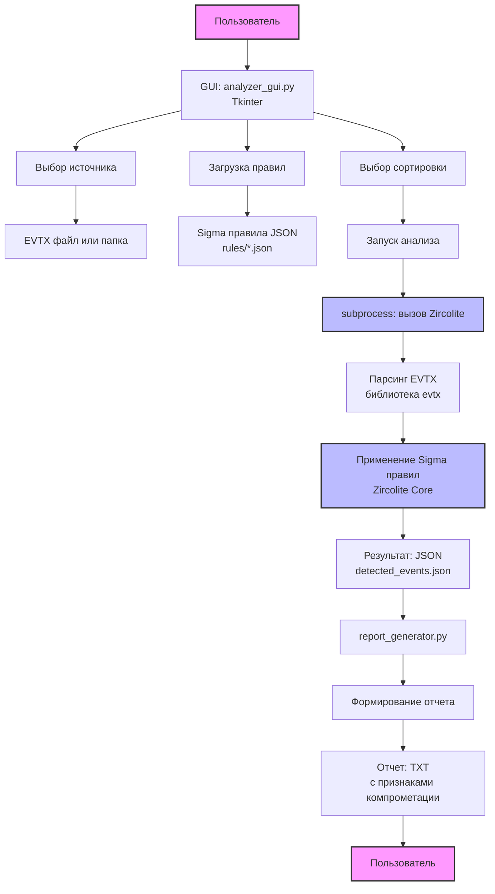

# Security Events Analyzer

Инструмент для анализа Windows Event Log (EVTX) файлов с использованием Sigma правил для обнаружения признаков компрометации.

## Возможности

- Анализ отдельных EVTX файлов или целых папок
- Использование нескольких файлов правил одновременно
- Генерация отчетов с сортировкой по:
  - Уровню критичности
  - Количеству срабатываний
  - Названию правила
  - Компьютеру
  - Каналу событий
  - EventID
- Просмотр списка загруженных правил
- Экспорт результатов в JSON и TXT

## Установка

pip install evtx pandas openpyxl

## Использование

python analyzer_gui.py

## Основано на

Zircolite (GNU LGPL) - https://github.com/wagga40/Zircolite

python-evtx (MIT) - https://github.com/williballenthin/python-evtx

Sigma Rules (DRL 1.0) - https://github.com/SigmaHQ/sigma

## Лицензия

Исходный код проекта: MIT License

Zircolite: GNU LGPL

python-evtx: MIT

Sigma Rules: DRL 1.0

## Авторы

Пундак Алиса Сергеевна

Саматова Анастасия Романовна

Куприянова Екатерина Алексеевна

Скурыхина Евгения Максимовна

## Архитектура системы

